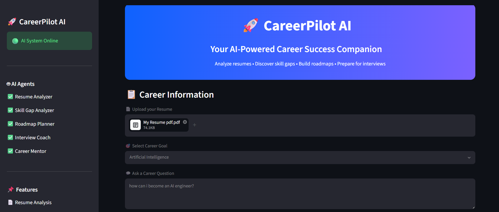
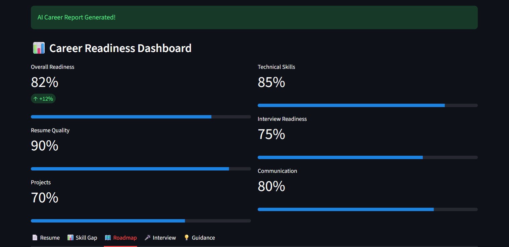
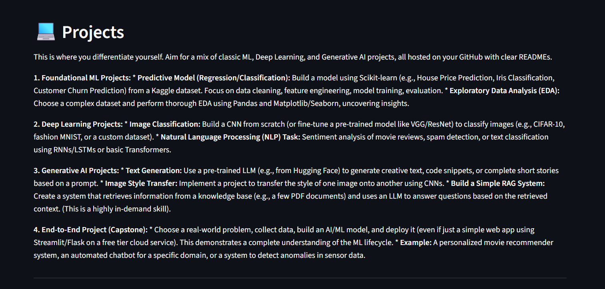

# 🚀 CareerPilot AI


> **An AI-powered multi-agent career guidance platform that analyzes resumes, identifies skill gaps, generates personalized learning roadmaps, prepares interview questions, and provides career guidance.**

---

## 🌐 Live Demo

👉 **Try CareerPilot AI Here**

https://careerpilot-aigit-2ermdpvoyakey6wzyqbyrr.streamlit.app/

## ✨ Highlights

- 🤖 Multi-Agent AI Architecture
- 📄 Resume Analysis
- 📊 Skill Gap Identification
- 🗺️ Personalized Learning Roadmap
- 🎤 Interview Preparation
- 💡 AI Career Guidance
- 📥 Downloadable PDF Report
- 🌐 Live Web Application
---

## 🔗 Quick Links

📂 GitHub Repository

https://github.com/macharlaveenajasmine-sys/careerpilot-ai

---

## 📌 Overview

CareerPilot AI is an intelligent career assistant designed to help students and job seekers make informed career decisions.

The application leverages Google's Gemini AI through a multi-agent architecture to provide personalized career recommendations based on a user's resume and career aspirations.

---
# 📸 Application Preview

## 🏠 Home Page



---

## 📊 Career Dashboard



---

## 🗺️ AI Career Roadmap



# ✨ Features

✅ Resume Analysis

- Analyze uploaded PDF resumes
- Identify strengths and weaknesses
- Provide improvement suggestions

---

✅ Skill Gap Analysis

- Compare current skills with career requirements
- Identify missing technical and soft skills
- Recommend areas for improvement

---

✅ Personalized Learning Roadmap

- 30-Day Learning Plan
- 90-Day Learning Plan
- 6-Month Career Roadmap

---

✅ Interview Preparation

- HR Interview Questions
- Technical Interview Questions
- Coding Preparation Tips
- Interview Advice

---

✅ Career Guidance

- Personalized AI career recommendations
- Certification suggestions
- Project recommendations
- Career growth strategy

---

✅ Career Readiness Dashboard

- Resume insights
- Career progress visualization
- AI-generated recommendations

---

✅ Downloadable PDF Report

Generate and download a professional AI career report.

---

# 🏗 Multi-Agent Architecture

CareerPilot AI uses multiple specialized AI agents.

```
                   User

                     │

         Upload Resume + Career Goal

                     │

          Career Manager Agent

                     │

 ┌──────────┬──────────┬──────────┬──────────┐

 │          │          │          │

Resume   Skill Gap   Roadmap   Interview

 Agent      Agent      Agent      Agent

 │

 └───────────────┬─────────────────┘

                 │

        Career Guidance Agent

                 │

         Final AI Career Report
```

---

# 🛠 Tech Stack

- Python 3.13
- Streamlit
- Google Gemini 2.5 Flash API
- ReportLab
- PyPDF2
- python-dotenv
- Git & GitHub

---

# 📂 Project Structure

```
careerpilot-ai/

│

├── agents/

│   ├── career_manager.py

│   ├── career_mentor.py

│   ├── resume_agent.py

│   ├── skill_gap_agent.py

│   ├── roadmap_agent.py

│   └── interview_agent.py

│

├── tools/

│   └── resume_parser.py

│

├── ui/

│   └── dashboard.py

│

├── utils/

│   ├── gemini_client.py

│   └── pdf_generator.py

│

├── app.py

├── requirements.txt

└── README.md
```

---

# 🚀 Installation

Clone the repository

```bash
https://github.com/macharlaveenajasmine-sys/careerpilot-ai.git
```

Move into the project

```bash
cd careerpilot-ai
```

Install dependencies

```bash
pip install -r requirements.txt
```

Create a `.env` file

```env
GOOGLE_API_KEY=YOUR_API_KEY
```

Run the application

```bash
streamlit run app.py
```
# 🎥 Demo

A short demonstration video showcasing:

- Resume Upload
- AI Resume Analysis
- Skill Gap Detection
- Personalized Roadmap
- Interview Preparation
- PDF Report Generation
---

# 🎯 Future Improvements

- ATS Resume Score
- AI Mock Interviews
- Voice-based Career Coach
- Job Recommendation Engine
- Resume Builder
- LinkedIn Profile Analyzer

---

## 👩‍💻 Developer

**Veena Jasmine Macharla**

🎓 B.Tech CSE(AI&ML) Student

💡 Passionate about Artificial Intelligence, Multi-Agent Systems, and Career Technology

---

# 📜 License

This project is developed for educational and hackathon purposes.
